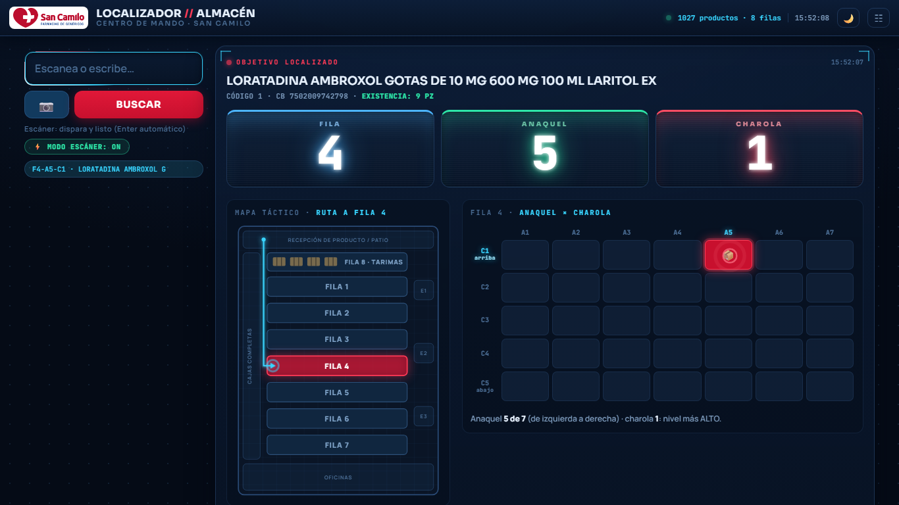
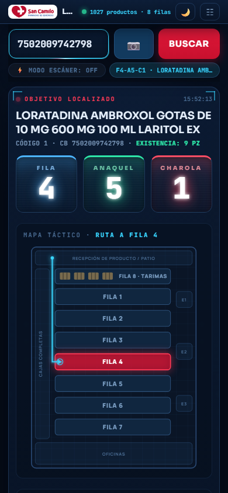

# Localizador Visual de Almacén — Farmacias San Camilo

Escanea un producto con la **pistola** o la **cámara del celular** y la página muestra
**dónde va**: la ruta hasta la fila en el croquis del almacén, la celda exacta en la
rejilla anaquel × charola, y la existencia según el último archivo.

**➡️ https://retana1885.github.io/buscador/**

| Escritorio (estación con pistola) | Celular (pasillo, con cámara) |
|:---:|:---:|
|  |  |

## Qué hace

- **Búsqueda** por código de barras (principal y secundarios), código interno o nombre.
  Ignora ceros a la izquierda (Excel se los come al guardar).
- **Modo escáner** ⚡ — pensado para pistola: el campo mantiene el foco y se limpia tras
  cada lectura; dispara y listo (ON automático en PC, apagable en pantalla).
- **Modo cámara** 📷 — funciona en iPhone y Android (requiere HTTPS, Pages lo da).
  Beep + vibración al detectar; lámpara 🔦 si el teléfono lo permite. Usa el lector nativo
  del navegador y cae solo a un motor de respaldo (ZXing) cuando no existe o no responde.
- **Mapa que orienta**: ruta animada de Recepción a la fila destino, celda parpadeando,
  y leyenda en lenguaje llano ("Anaquel 5 de 7, de izquierda a derecha · charola 1: nivel más ALTO").
- **Fila 8 = zona de tarimas** junto a recepción: se muestra "A PISO", sin inventar
  anaquel/charola.
- **Tema claro/oscuro y estilo de fondo** (botones arriba a la derecha; cada quien guarda
  su preferencia en su navegador).
- Tras la primera búsqueda, el buscador se hace panel lateral (PC) o barra compacta fija
  (celular) para que el mapa quede completo en pantalla.
- Historial de los últimos 5 escaneos, existencia de referencia y aviso claro cuando un
  código no está en el catálogo.

## Cómo actualizar posiciones

1. Reemplazar `posiciones_buscador.xlsx` en este repositorio (rama `main`) — igual que siempre.
2. Esperar 1–2 min el despliegue de Pages y recargar con **Ctrl + F5**.

La app detecta las columnas por nombre: `Cod. De Barras`, `Secundarios`, `Codigo`,
`Nombre`, `Fila`, `Anaquel`, `Charola`. La hoja 2 de existencias
(`Art_Codigo` / `AA_ExistenciaActualU`) es opcional. Las dimensiones de cada fila
(7 o 9 anaqueles, 5 charolas) se derivan del propio archivo.

## Archivos

| Archivo | Qué es |
|---|---|
| `index.html` | La aplicación completa (un solo archivo, sin build ni backend) |
| `v1.html` | Respaldo de la versión anterior (solo texto) |
| `posiciones_buscador.xlsx` | Fuente de datos |
| `favicono.ico`, `logo_sancamilo.png` | Identidad |
| `docs/` | Capturas para este README |

## Notas técnicas

- Un solo HTML vanilla; dependencias por CDN: SheetJS (leer el Excel), Google Fonts y
  `@zxing/library` (solo se descarga si el teléfono necesita el motor de respaldo).
- La cámara exige HTTPS; en local se prueba con `python -m http.server` en `localhost`.
- Si no ves un cambio reciente, recarga con caché forzada (Ctrl + F5).
